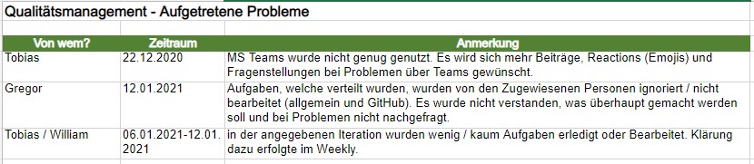
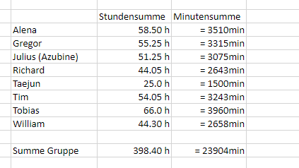
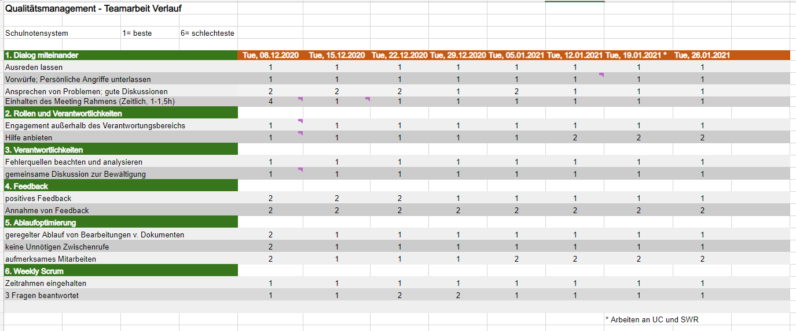

== QM Review zum bisherigen Projekt

=== Rückblick auf das Projekt bisher

==== Einleitung
Zum Abschluss der ersten Hälfte der Projektverwirklichung möchten wir noch einmal einen prüfenden Blick auf die bisherige Arbeitsweise, Bewältigung und die Einhaltung der gesetzten Qualitätsmanagement-Regeln werfen und ein Fazit aus dem Erlernten ziehen.

==== Verbessern der Meeting Qualität

Unser wöchentliches Meeting fand stets am Dienstagabend statt. Hier hatten wir zu Anfangs einige Probleme: Die zu bearbeitenden Dokumente wurden per Screensharing geteilt, wir unterhielten uns zu den Problemen, aber leider gab es oft Verwirrungen, an welcher Stelle wir uns gerade befinden, ob durch mangelnde Aufmerksamkeit oder ungewollte Gedankensprünge bei der Klärung von Problemen. Ebenfalls gab es ein Fehlen von Feedback, wie die getroffenen Änderungen und Bestimmungen angenommen wurden; es meldeten sich nur wenige Personen zu Wort. Dadurch zogen sich die Gespräche in die Länge, viele der Meetings zogen sich bis zu 3 Stunden.

Diesen unnötig langen Besprechungen wollten wir entgegenwirken. Deshalb entschieden wir uns, einen Redeführer einzusetzen. Dieser gab uns vorab die Themen als Liste, mit der ungefähren Zeiteinschätzung pro Thema. Er fungierte als Meeting-Koordinator, stellte die Dokumente und Probleme vor, und leitete Diskussionen. Wurden Absprachen getroffen, wurde gefragt, ob jemand etwas gegen die Anpassung hat, bei Nichtmeldung wurde es als stille Zustimmung gewertet. Ebenfalls steuerten wir Wortmeldungen und Einrufe über das nutzen des “Hand heben” Systems auf MS Teams. Meldete man sich, wurde man aufgerufen und durfte Fragen oder Einwände einbringen. So wurde keine Person in ihrem Redefluss und ihren Erklärungen gestört. Die Meetings wurden zusätzlich von einem Protokollanten dokumentiert, um Aufgaben festzuhalten und im Nachgang zu verteilen.
All diese Maßnahmen trugen zu einer enormen Verbesserung der Meetings bei, wir konnten unser selbst gestecktes Ziel von 2 Stunden pro Meeting zuverlässig halten und somit auch die Produktivität und Moral steigern.

==== Ansprechen von Problemen 

Keine Teamarbeit verläuft reibungsfrei, dies war uns allen von Anfang an klar. Deshalb waren wir umso dankbarer darüber, dass wir Probleme offen ansprechen konnten. Über Misstände in der Arbeitsbewältigung konnte offen diskutiert werden und die Gründe dafür ermittelt werden. Innerhalb maximal einer Iteration konnten Verbesserungen oder das Einstellen des Problems festgestellt werden.
Folgende Probleme wurden wärend der Projektarbeit festgestellt und bewältigt:

Während der Arbeit mit unserem Auftraggeber konnten wir ebenfalls Probleme erkennen. Oftmals fielen uns weiterführende Lösungen für die Probleme des Stakeholders ein, welche aber oftmals nicht angenommen wurden und sich für eine andere Version entschieden wurde. Dies führte zu einem frustrierten Projektteam. 

Das Problem konnten wir in drei Stufen lösen: Zunächst einigten wir uns im Team auf einen gemeinsamen Standpunkt. Wir versuchten dabei, so fachlich und objektiv wie möglich die Diskrepanz zwischen den Anforderungen und dem technisch Machbaren zu definieren. Dabei durfte Jeder zu Wort kommen: Wir sammelten gemeinsam fundierte Argumente und erarbeiteten eine Empfehlung des gesamten Teams, wie man weiter verfahren könne. Im nächsten Schritt stellten wir diese dem Stakeholder vor und konnten gemeinsam eine Übereinstimmung erreichen. Dass wir mit diesem Vorgehen einen guten Weg beschritten hatten, konnten wir im dritten Schritt durch eine Konsultation von Prof. Anke überprüfen. Diese Rückkopplung sowie das entgegengebrachte Verständnis des Stakeholders bestätigte uns die Wirksamkeit unserer qualitatitv ausgelegten Kommunikationskultur gegenüber allen Beteiligten.

==== Zeitverteilung

Positiv hervortretend ist die Verteilung der Zeitinvestition durch jedes Projektmitglied. Über das gesamte Team konnte eine gleichmäßige Verteilung von Stunden festgestellt werden, was unterstreicht, dass jeder seine Aufgaben gut verstanden hat und absolvieren konnte. 

==== Abschließendes Fazit

Mit der Bearbeitung des Projektes kann das Projektteam sehr zufrieden seien. Die Aufgabenverteilung wurde fair durchgeführt, auftretende Probleme wurden schnell erkannt, offen angesprochen und ihnen entgegengewirkt. Mit zunehmender Vertrautheit in den Iterationen konnte die Arbeitsqualität stetig verbessert werden. Auch die Arbeitsmoral, die Zusammenarbeit im Team und die allgemeine Kommunikation konnte gehalten, wenn nicht sogar verbessert werden. 
Der Verlauf der Arbeit im Meeting wurde ebenfalls durch die Verwendung einer Tracking Tabelle dokumentiert.

Durch das Ausscheiden einiger Teammitgliedern im nächsten Semester wissen wir, das hier einige Hürden auf uns zukommen werden, aber mit Blick auf das bisher absolvierte Projekt können wir uns sicher seien, das wir diese ebenfalls überwinden können.

